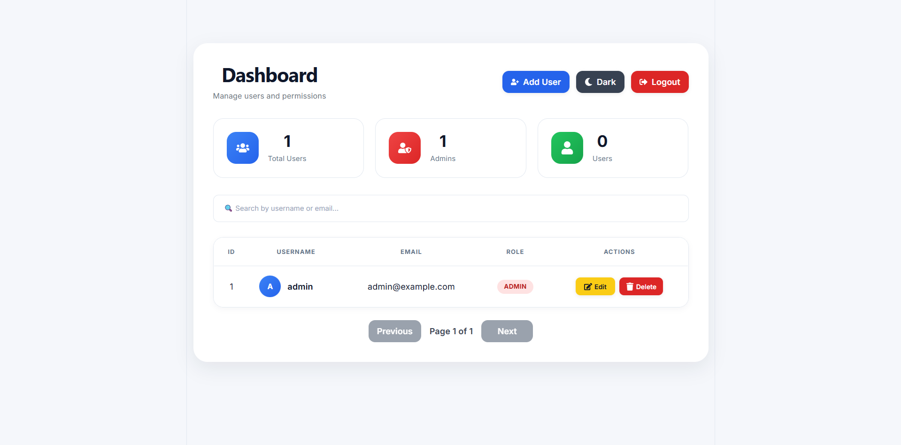

# 🚀 User Management System

A modern Full Stack User Management System built with **Spring Boot**, **React**, **JWT Authentication**, and **PostgreSQL**.


---

### 🔗 Live Demo

Frontend: **https://user-management-system-five-omega.vercel.app**

Backend API: **https://user-management-system-wsnm.onrender.com**

Swagger: **https://user-management-system-wsnm.onrender.com/swagger-ui/index.html**

> ⚠️ Backend is hosted on a free tier and may take 30-50 seconds to wake up after inactivity.

---

# 📖 Overview

This project is a complete Full Stack User Management System demonstrating modern Java backend development and React frontend development.

It includes secure JWT authentication, role-based authorization, CRUD operations, pagination, searching, sorting, validation, global exception handling, and REST API best practices.

---

# ✨ Features

## 🔐 Authentication

- JWT Authentication
- Refresh Token
- Login
- Logout
- BCrypt Password Encryption
- Protected Routes

## 👤 User Management

- Create User
- Update User
- Delete User
- View User
- Search Users
- Pagination
- Sorting

## 🛡 Security

- Spring Security
- JWT Access Token
- Refresh Token
- Role-Based Authorization
- BCrypt Password Hashing

## ✅ Validation

- Bean Validation
- Email Validation
- Password Validation
- Duplicate Email Protection
- Duplicate Username Protection

## ⚠ Exception Handling

- Global Exception Handler
- Validation Errors
- JWT Exceptions
- Authentication Errors
- HTTP Status Codes
- Custom Exceptions

---

# 🛠 Tech Stack

## Backend

| Technology        | Version |
| ------------------ | ------- |
| Java                | 21      |
| Spring Boot         | 3.x     |
| Spring Security     | ✔       |
| Spring Data JPA     | ✔       |
| Hibernate           | ✔       |
| JWT                 | ✔       |
| PostgreSQL (Neon)   | ✔       |
| Maven               | ✔       |
| Swagger/OpenAPI     | ✔       |
| Docker              | ✔       |

## Frontend

| Technology     | Version |
| --------------- | ------- |
| React           | 19      |
| Vite            | ✔       |
| React Router    | ✔       |
| Axios           | ✔       |
| Bootstrap 5     | ✔       |
| Context API     | ✔       |
| React Toastify  | ✔       |
| SweetAlert2     | ✔       |

## Infrastructure

| Service    | Purpose               |
| ---------- | ---------------------- |
| Render     | Backend hosting         |
| Vercel     | Frontend hosting        |
| Neon       | Managed PostgreSQL      |

---

# 🏗 Architecture

```
React (Vercel)
      │
      ▼
 REST API
      │
      ▼
Spring Boot (Render)
      │
      ▼
Spring Security
      │
      ▼
Hibernate / JPA
      │
      ▼
PostgreSQL (Neon)
```

---

# 📂 Project Structure

```
user-management-system
│
├── frontend
│   ├── api
│   ├── components
│   ├── context
│   ├── pages
│   ├── services
│   └── styles
│
├── src
│   └── main
│       └── java
│           └── com.nazar.usermanagementsystem
│               ├── config
│               ├── controller
│               ├── dto
│               ├── entity
│               ├── exception
│               ├── mapper
│               ├── repository
│               ├── security
│               └── service
```

---

# 🌐 REST API

| Method | Endpoint         | Description   |
| ------ | ---------------- | -------------- |
| POST   | `/auth/register` | Register       |
| POST   | `/auth/login`    | Login          |
| POST   | `/auth/refresh`  | Refresh Token  |
| POST   | `/auth/logout`   | Logout         |
| GET    | `/users`         | Get Users      |
| GET    | `/users/{id}`    | Get User       |
| PUT    | `/users/{id}`    | Update User    |
| DELETE | `/users/{id}`    | Delete User    |

Full interactive documentation available via [Swagger UI](https://user-management-system-wsnm.onrender.com/swagger-ui/index.html).

---

# 📸 Screenshots

## Login


## Dashboard



## Swagger


---

# ⚙ Installation

## Clone repository

```
git clone https://github.com/nazar-svytka/user-management-system.git
```

## Backend

Copy the example config and fill in your own values:

```
cp src/main/resources/application.properties.example src/main/resources/application.properties
```

Run:

```
mvn spring-boot:run
```

Swagger:

```
http://localhost:8080/swagger-ui/index.html
```

## Frontend

```
cd frontend

npm install

npm run dev
```

---

# 🚀 Future Improvements

- Email Verification
- Password Reset
- User Profile Pictures
- Unit Tests
- Integration Tests
- GitHub Actions CI/CD

---

# 👨‍💻 Author

## Nazar Svytka

Junior Full Stack Developer

Java • Spring Boot • React • PostgreSQL

GitHub: <https://github.com/nazar-svytka>

---

⭐ If you found this project useful, please consider giving it a star!

Distributed under the [MIT License](LICENSE).
