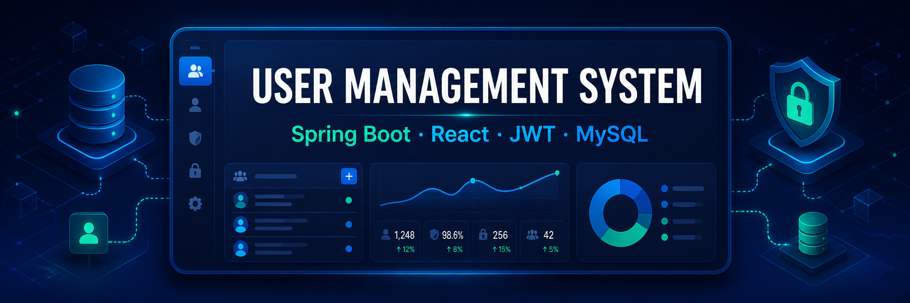
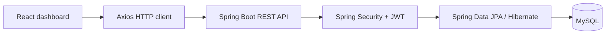
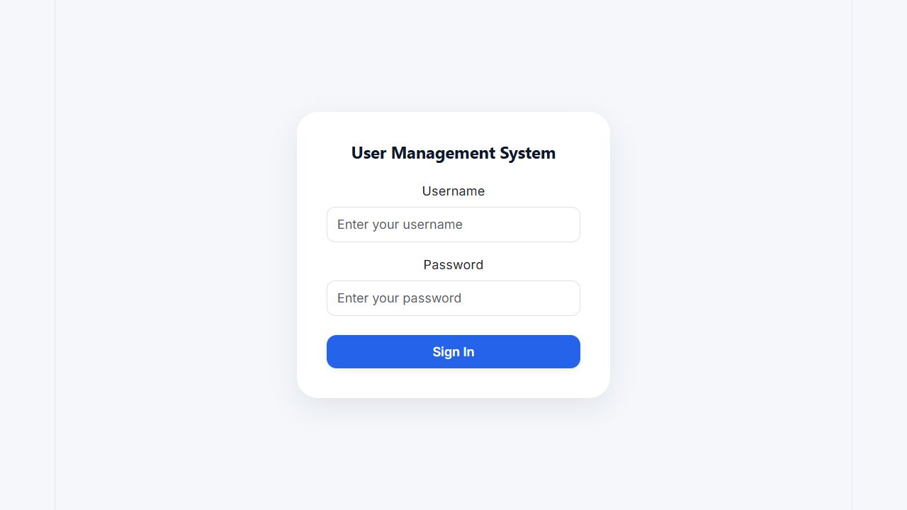
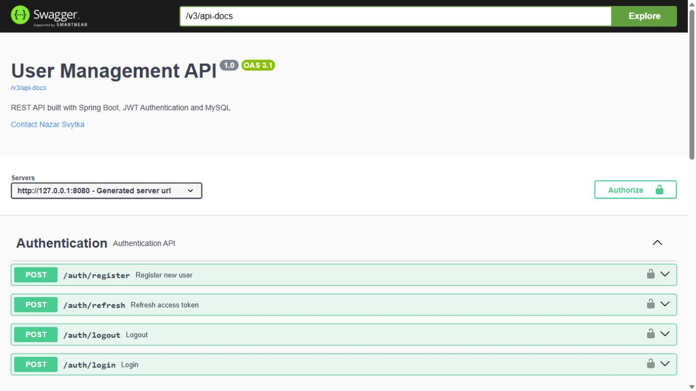

<div align="center">



# User Management System

A full-stack application for secure, role-based user administration, built with Spring Boot and React.

[](https://openjdk.org/)
[](https://spring.io/projects/spring-boot)
[](https://react.dev/)
[](https://www.mysql.com/)
[](LICENSE)

</div>

## Overview

User Management System is a portfolio-ready full-stack project that demonstrates secure authentication, role-based access control, and complete user lifecycle management. It includes an interactive React dashboard and documented REST API.

## Features

- JWT authentication with access-token refresh and token revocation on logout
- Role-based authorization for `ADMIN` and `USER`
- User CRUD: create, view, edit, and delete users
- Server-side pagination, search, and sorting
- Request validation and centralized API error handling
- Protected frontend routes with automatic token refresh
- Responsive dashboard with dark mode, toast notifications, and delete confirmation
- Interactive OpenAPI / Swagger documentation

## Tech stack

| Area | Technologies |
| --- | --- |
| Backend | Java 21, Spring Boot 4.1, Spring Security, Spring Data JPA, Hibernate |
| Security | JWT, BCrypt, role-based authorization |
| Frontend | React 19, Vite, React Router, Axios, Bootstrap 5 |
| Database | MySQL 8.4 |
| API documentation | Springdoc OpenAPI / Swagger UI |
| Local infrastructure | Docker Compose |

## Architecture



## Interface

### Sign in

<p align="center">
  
</p>

### API documentation

<p align="center">
  
</p>

## API

Once the backend is running, explore the complete contract in [Swagger UI](http://localhost:8080/swagger-ui/index.html).

| Method | Endpoint | Access | Description |
| --- | --- | --- | --- |
| `POST` | `/auth/register` | Public | Register a user |
| `POST` | `/auth/login` | Public | Sign in and receive access and refresh tokens |
| `POST` | `/auth/refresh` | Public | Refresh an access token |
| `POST` | `/auth/logout` | Public | Revoke a token |
| `GET` | `/users` | `ADMIN` | List users with pagination, search, and sorting |
| `GET` | `/users/{id}` | `ADMIN`, `USER` | Get a user by ID |
| `POST` | `/users` | `ADMIN` | Create a user |
| `PUT` | `/users/{id}` | `ADMIN` | Update a user |
| `DELETE` | `/users/{id}` | `ADMIN` | Delete a user |

## Run locally

### Prerequisites

- Java 21
- Node.js 20 or later
- Docker Desktop

### 1. Start MySQL

From the project root:

```powershell
docker compose up -d mysql
```

Docker publishes the MySQL service at `localhost:3307`. The backend's local configuration already uses this port.

### 2. Start the backend

```powershell
.\mvnw.cmd spring-boot:run
```

The API starts at `http://localhost:8080`, and Swagger UI is available at `http://localhost:8080/swagger-ui/index.html`.

### 3. Start the frontend

Open a second terminal:

```powershell
cd frontend
npm install
npm run dev
```

Open `http://localhost:5173` in your browser.

## Run the backend in Docker

To run MySQL and the Spring Boot API together in containers:

```powershell
docker compose up --build
```

The containerized backend is exposed at `http://localhost:8081`.

## Free deployment on Render

The repository includes a `render` Spring profile for a free Render Postgres database. Local development continues to use MySQL through the default profile.

1. Create a **Postgres** database on Render with the **Free** instance type.
2. Create a **Web Service** from this repository using the `Dockerfile`.
3. Use the same Render region for both services, then set these backend environment variables:

| Variable | Value |
| --- | --- |
| `SPRING_PROFILES_ACTIVE` | `render` |
| `JDBC_DATABASE_URL` | PostgreSQL internal URL in JDBC format: `jdbc:postgresql://HOST:5432/DATABASE` |
| `DATABASE_USERNAME` | PostgreSQL username from Render |
| `DATABASE_PASSWORD` | PostgreSQL password from Render |
| `JWT_SECRET` | A new long random secret, used only for deployment |
| `APP_CORS_ALLOWED_ORIGINS` | The Vercel frontend URL, after the frontend is deployed |

Render provides a free Postgres database for portfolio use, but it expires after 30 days. Export any data you want to retain before that time.

## Project structure

```text
user-management-system/
├── frontend/                         # React + Vite client
│   └── src/
│       ├── api/                      # Axios configuration
│       ├── components/               # Protected routes
│       ├── context/                  # Authentication state
│       ├── pages/                    # Login and dashboard
│       └── services/                 # API calls
├── src/main/java/com/nazar/usermanagementsystem/
│   ├── config/                       # Security and OpenAPI configuration
│   ├── controller/                   # REST endpoints
│   ├── dto/                          # Request and response models
│   ├── entity/                       # JPA entities
│   ├── exception/                    # Global error handling
│   ├── security/                     # JWT authentication
│   └── service/                      # Business logic
├── docs/assets/                      # README assets
├── docker-compose.yml
└── Dockerfile
```

## Verification

- Frontend production build succeeds with `npm run build`.
- Backend compiles on Java 21.
- Swagger UI is available locally after starting the API and MySQL.

## Author

**Nazar Svytka**<br>
Junior Full Stack Developer — Java, Spring Boot, React, and MySQL

[GitHub](https://github.com/nazar-svytka)

## License

Distributed under the [MIT License](LICENSE).
